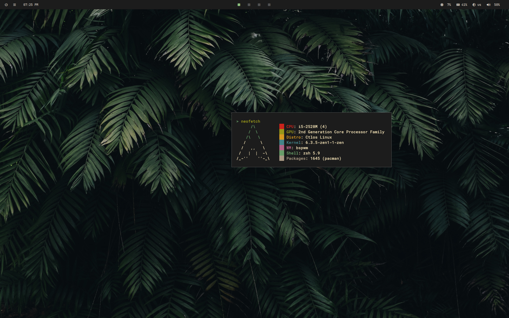
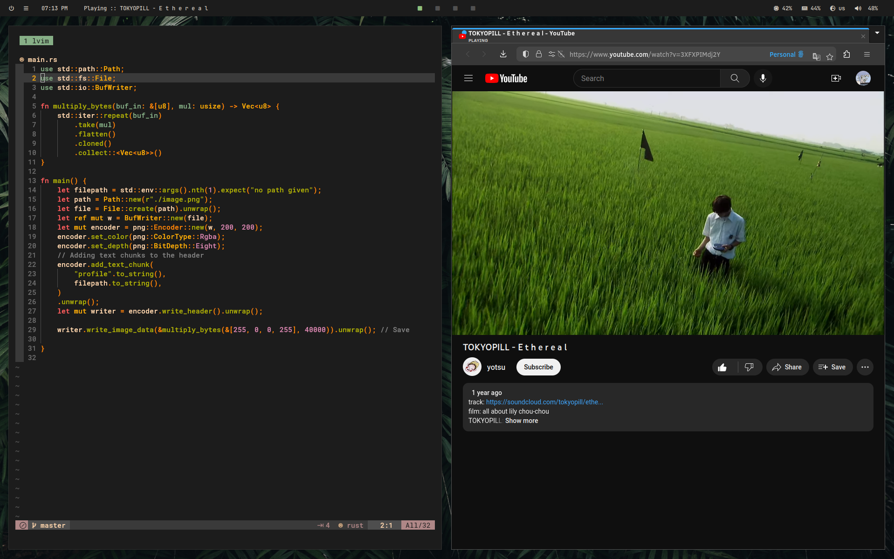

<p align="center">
  <a href="#features-with-notes">Features with Notes</a> •
  <a href="#dependencies">Dependencies</a>
</p>

`.dotfiles` that give me inner peace. Feel free to clone and edit as you wish. There are no fancy animations in picom. Only smooth fade in-out.

# Features with Notes

- [Click for wallpaper](images/wallpaper/tropical_leaves.jpg)
- [Click for video demonstration](https://vimeo.com/835027375)
- The first item in polybar to the left of center, displays the status of the current audio source, whether it is the media player or the browser. You can interact with audio playback via mouse clicks.
    - right-click pauses playback
    - left-click to resume playback
    - clicking the mouse wheel stops playback and removes the sound source from panel and the sound itself
- These `.dotfiles` are made on and are intended for the setup where the laptop is connected to the monitor via VGA and is on the left side of the monitor.
- To automatically adjust the screen when an additional monitor is connected - I use autorandr, which runs at the start of bspwm
- For some unknown reason, resizing the windows is incredibly laggy and spawn CPU spikes. For me this is not critical, but worth keeping in mind.

# Dependencies
I use [ctlos](https://ctlos.github.io/) as distro, which is based on Arch Linux. 

By default, you need these dependencies:
```console
bspwm sxhkd rofi tmux kitty zsh oh-my-zsh picom polybar playerctl autorandr xrandr nitrogen tint2 dunst thunar unclutter nm-applet xfce4-power-manager parcellite udiskie solaar
```

Feel free to adjust .dots for your setup
